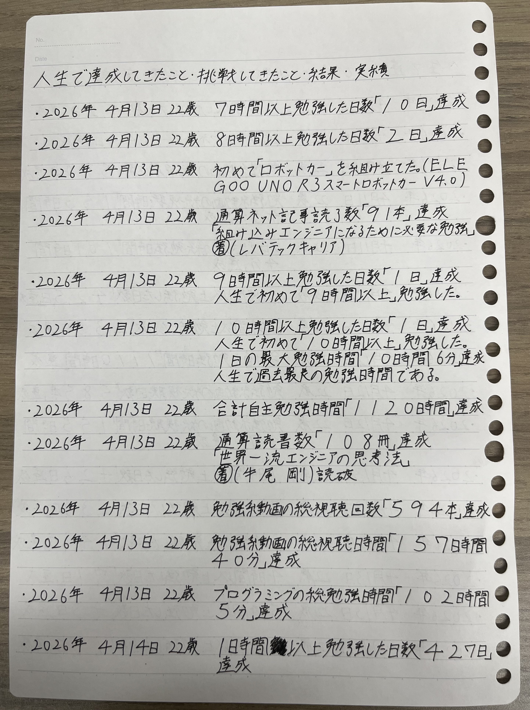
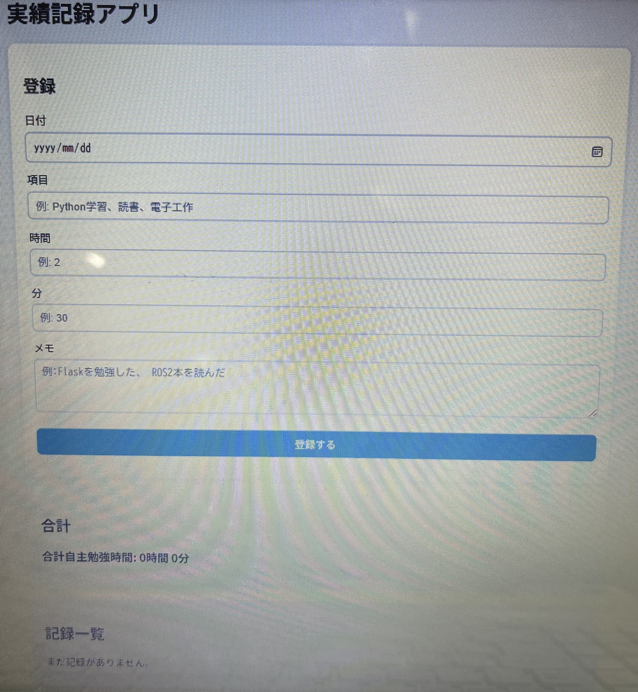

# 実績記録アプリ

## 開発背景
以前は、日々の実績を紙のノートに手書きで記録していました。しかし、手書きでの管理には手間がかかり、過去の記録の振り返りや集計もしにくいという課題がありました。そこで、実績をより簡単かつ効率的に記録・管理できるようにするためにPythonを用いたWebアプリを開発しました。

## 概要
日々の学習や作業時間を記録・管理できるシンプルなWebアプリ作りました。FlaskとSQLiteを使用しており、ブラウザから簡単に実績を登録・確認できます。

## 主な機能
- 日付ごとの実績登録
- カテゴリ別の記録（例：Python、読書、電子工作）
- 時間・分の入力と自動繰り上げ処理
- メモの記録
- 合計学習時間の表示
- 記録の削除機能

## 使用技術
- Python（Flask）
- SQLite（データベース）
- HTML / CSS
- Jinja2（テンプレートエンジン）

## 工夫した点
- 入力値のバリデーション（数値チェック）
- 未入力時のデフォルト値設定
- 分 → 時間の自動変換処理
- シンプルで見やすいカードUI
- 削除時の確認ダイアログ

## 今後の改善案
- 編集機能を追加する
- グラフ表示する
- 検索・フィルタ機能を追加する
- ログイン機能を追加する
- レスポンシブ対応強化する